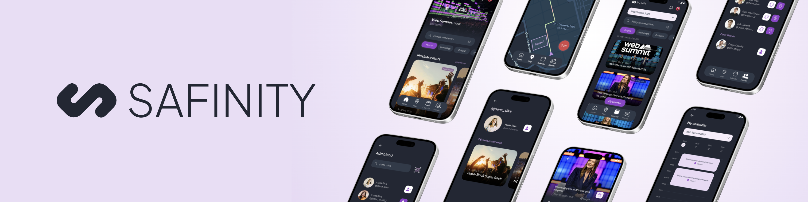
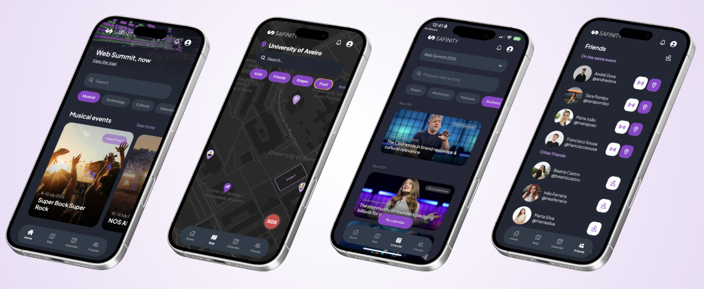

# Safinity

<p align="center">
  <a href="https://github.com/andredora/Safinity-app/actions/workflows/backend-ci.yml">
    
  </a>
  <a href="https://github.com/andredora/Safinity-app/actions/workflows/app-ci.yml">
    
  </a>
  <a href="https://github.com/andredora/Safinity-app/actions/workflows/backoffice-ci.yml">
    
  </a>
<a href="https://sonarcloud.io/summary/new_code?id=Safinity_Safinity-app">
  
</a>
  <br />
  
  
  
  
  
</p>



Safinity is a mobile-first event safety app for large venues, festivals and conferences. It combines event navigation, friend location awareness, realtime notifications, SOS flows, ticket linking and crowd-density insights into one Expo app backed by a NestJS API.

The goal is simple: help people enjoy crowded events without losing context, losing friends, or losing time when something urgent happens.

---

## What Safinity Does

Safinity is built around the live event experience:

- Attendees can sign in with Clerk and are automatically synced into the app database.
- Users can link tickets and access event-specific pages.
- Events, activities, tickets, maps, points of interest and friends come from PostgreSQL/PostGIS.
- Users can favourite activities and see them in a dedicated favourites calendar.
- Friends can be added through search, requests or QR code.
- Realtime notifications keep users updated about friend requests, SOS events and event alerts.
- SOS requests notify staff and friends attending the same active event.
- The map shows event points, stages, friend/user location and a crowd-density heatmap powered by sensors.
- Mapbox static maps are requested by the backend and delivered to the app.



---

## Repository Map

```text
Safinity-app/
├── backend/                  # NestJS API
│   ├── prisma/
│   │   └── schema.prisma     # PostgreSQL/PostGIS schema used by Prisma
│   ├── src/
│   │   ├── alerts/           # SOS/event alert handling
│   │   ├── auth/             # Clerk token validation and user sync
│   │   ├── common/           # Shared filters and helpers
│   │   ├── events/           # Events, activities, maps, favourites and tickets
│   │   ├── friends/          # Friend search, QR add, requests and buzz flow
│   │   ├── notifications/    # Notifications API and WebSocket realtime layer
│   │   ├── prisma/           # Prisma service
│   │   ├── sensors/          # Crowd-density sensors and ingestion logic
│   │   ├── sos/              # SOS request flow
│   │   ├── tickets/          # User ticket linking
│   │   └── users/            # Profile, roles and account data
│   ├── Dockerfile
│   └── package.json
│
├── frontend/                 # Expo / React Native app
│   ├── app/                  # expo-router screens and routes
│   │   ├── (tabs)/           # Home, map, calendar, friends, profile...
│   │   ├── activity-details/ # Activity details route
│   │   ├── event-details/    # Event details route
│   │   ├── sos.tsx           # SOS flow
│   │   └── qrcode-scan.tsx   # QR friend scanner
│   ├── assets/               # Images, icons, logos and fonts
│   ├── components/           # Reusable UI components
│   ├── constants/            # Theme and design tokens
│   ├── context/              # App-wide state providers
│   ├── data/                 # Static fallback data
│   ├── utils/                # API clients and helpers
│   └── package.json
│
├── backoffice/               # Admin/backoffice frontend workspace
├── db/
│   └── init.sql              # Local database bootstrap and seed data
├── docker-compose.yml        # Local PostGIS database + NestJS API
├── readme/                   # README images/mockups
└── README.md
```

---

## Tech Stack

| Area          | Tools                                              |
| ------------- | -------------------------------------------------- |
| Mobile app    | Expo SDK 54, React Native, expo-router, TypeScript |
| Styling       | styled-components, shared theme tokens             |
| Auth          | Clerk, JWT validation on the backend               |
| API           | NestJS, Prisma                                     |
| Database      | PostgreSQL with PostGIS                            |
| Realtime      | WebSocket notifications                            |
| Maps          | Mapbox Static Images API                           |
| Dev runtime   | Docker Compose                                     |
| Deploy target | Render backend + Supabase Postgres/PostGIS         |

---

## Quick Start

### 1. Clone and install

```bash
git clone <repo-url>
cd Safinity-app
```

Install frontend dependencies:

```bash
cd frontend
npm install
cd ..
```

Install backend dependencies only if you plan to run it outside Docker:

```bash
cd backend
npm install
cd ..
```

### 2. Configure environment variables

Create the files described in [Environment Variables](#environment-variables). The short version is:

- root `.env` for Docker Compose;
- `backend/.env` for NestJS;
- `frontend/.env` for Expo.

### 3. Start the local backend and database

```bash
docker compose up -d --build
```

Check the API:

```bash
curl -i http://localhost:3000/health
```

### 4. Start the app

```bash
cd frontend
npm run start
```

Then open it with:

- Expo Go on a physical phone;
- iOS Simulator;
- Android Emulator.

---

## Environment Variables

Never commit real secrets. The values below are examples.

### Root `.env`

Used by `docker-compose.yml`.

```env
DB_NAME=safinity
DB_USER=safinity
DB_PASSWORD=<local-db-password>
DB_HOST=database
DB_PORT=5432
API_PORT=3000
DATABASE_URL=<local-docker-postgres-url>
```

Inside Docker, `DB_HOST` must be `database` because that is the Compose service name.

### `backend/.env`

Used by the NestJS API.

```env
PORT=3000
DATABASE_URL=<postgres-connection-url>
CLERK_SECRET_KEY=sk_test_xxxxxxxxx
MAPBOX_TOKEN=pk.xxxxxxxxx
SENSOR_WEBHOOK_SECRET=change_me
ENABLE_SWAGGER=true
```

Useful notes:

- `CLERK_SECRET_KEY` comes from Clerk Dashboard -> API keys -> Secret key.
- `MAPBOX_TOKEN` is used by the backend to request static map images.
- `SENSOR_WEBHOOK_SECRET` protects sensor/webhook ingestion.
- Set `ENABLE_SWAGGER=false` in deployed environments if you do not want `/api` exposed.

### `frontend/.env`

Used by Expo. Public app variables need the `EXPO_PUBLIC_` prefix.

```env
EXPO_PUBLIC_CLERK_PUBLISHABLE_KEY=pk_test_xxxxxxxxx
EXPO_PUBLIC_API_URL=https://safinity-app.onrender.com
```

For local backend testing, temporarily override the value:

```env
EXPO_PUBLIC_API_URL=http://localhost:3000
```

If `EXPO_PUBLIC_API_URL` is missing, the mobile app defaults to the Render backend at `https://safinity-app.onrender.com`.

---

## Running The Project

### Local with Docker

From the project root:

```bash
docker compose up -d --build
```

This starts:

- `safinity-db`: PostgreSQL with PostGIS;
- `safinity-api`: NestJS API on port `3000`.

Useful checks:

```bash
docker ps
docker logs -f safinity-api
docker logs -f safinity-db
curl -i http://localhost:3000/health
```

### Frontend

```bash
cd frontend
npm run start
```

Other useful commands:

```bash
npm run ios
npm run android
npm run web
npm run lint
npm run format:check
```

### Backend without Docker

Use this when you want the database in Docker but the API running directly on your machine.

Start only the database:

```bash
docker compose up -d database
```

Point `backend/.env` to localhost:

```env
DATABASE_URL=<local-postgres-url>
```

Run the API:

```bash
cd backend
npm install
npx prisma generate
npm run start:dev
```

The API should answer at:

```text
http://localhost:3000
```

---

## Database

The database is PostgreSQL with PostGIS. It stores:

- Clerk-synced users;
- events, event images and event metadata;
- activities and favourite activities;
- ticket master codes and linked user tickets;
- friendships and friend request states;
- notifications and per-user read state;
- SOS requests and generated alerts;
- points of interest, stages, sensors and user locations.

Open a local database shell:

```bash
docker exec -it safinity-db psql -U safinity -d safinity
```

Useful queries:

```sql
select id, name, username, email, role from users order by name;
select id, name, status, start_date, end_date from event order by id;
select user_id, event_id, ticket_code from user_tickets order by linked_at desc;
select id, title, category, event_id, time from notifications order by time desc;
```

---

## Deploy Notes

The backend can be deployed to Render using the `backend/Dockerfile`.

For Render + Supabase, configure at least:

```env
DATABASE_URL=<supabase-postgres-url-with-ssl>
CLERK_SECRET_KEY=sk_test_or_sk_live_xxxxxxxxx
MAPBOX_TOKEN=pk.xxxxxxxxx
ENABLE_SWAGGER=false
NODE_ENV=production
```

Important details:

- Do not put quotes around `DATABASE_URL` in Render.
- Do not use `${DB_PASSWORD}` inside Render's `DATABASE_URL`; put the final URL value directly.
- If using the Supabase pooler, include the correct pooler username and SSL mode.
- Keep `CLERK_SECRET_KEY` only on the backend.
- The mobile app should only receive `EXPO_PUBLIC_CLERK_PUBLISHABLE_KEY`.

The deployed app currently targets:

```text
https://safinity-app.onrender.com
```

---

## Quality Checks

Safinity uses GitHub Actions for CI and SonarCloud for code quality verification.

SonarCloud is configured through:

```text
sonar-project.properties
.github/workflows/sonarcloud.yml
```

To enable it in a new fork/repository:

1. Create/import the project in SonarCloud.
2. Confirm the project key and organization match `sonar-project.properties`.
3. Create a GitHub repository secret named `SONAR_TOKEN`.
4. Push to `main` or open a pull request against `main`.

The SonarCloud workflow installs project dependencies, runs backend Jest coverage, then sends the analysis to SonarCloud. The Quality Gate badge at the top of this README becomes active after the first successful scan.

Before committing backend changes:

```bash
cd backend
npm run lint:check
npm test -- --runInBand
```

Before committing frontend changes:

```bash
cd frontend
npm run lint
npm run format:check
```

General sanity check:

```bash
git status
git diff --stat
```

---

## Manual Test Checklist

Use this list after changing authentication, events, friends, maps or notifications:

- Login with email/password.
- Login with Google.
- Open profile and confirm user data loads from the API.
- Link a ticket from event details or wallet.
- Open event details and navigate to the correct map/calendar.
- Favourite an activity and confirm it appears in Favourites activities.
- Search for a friend from database users.
- Send, accept and remove a friend request.
- Add a friend through QR code.
- Open the map and confirm points of interest, stages and user location render.
- Toggle the heatmap filter.
- Send an SOS request and confirm realtime notifications.
- Logout and confirm protected pages no longer use the previous session.

---

## Troubleshooting

### Docker says it cannot connect to the daemon

Docker Desktop is not running or is still starting.

```bash
docker info
```

If the server section fails, open Docker Desktop and wait until it is ready.

### API container is unhealthy

Check logs:

```bash
docker logs --tail 150 safinity-api
```

Common causes:

- missing `CLERK_SECRET_KEY`;
- invalid `DATABASE_URL`;
- database container is not healthy;
- port `3000` is already in use.

### Supabase returns Prisma authentication errors

If Prisma shows `P1000`, the database credentials are wrong.

If Prisma says the URL must start with the PostgreSQL protocol, the value in Render probably includes quotes, `DATABASE_URL=`, spaces, or an unresolved variable.

The Render value should start directly with the database protocol, with no quotes or key name pasted into the value field.

### Expo Go says the project is incompatible

The app uses Expo SDK 54. The installed Expo Go version must support that SDK. If the physical phone cannot install a compatible Expo Go version, use an emulator/simulator or build a development/native build deliberately.

### Physical phone gets `Network Error`

Check the API locally:

```bash
curl -i http://localhost:3000/health
```

Then try from the phone browser:

```text
http://<your-laptop-ip>:3000/health
```

If the phone cannot open it:

- put phone and laptop on the same network;
- avoid networks that isolate devices, such as some university networks;
- try a phone hotspot;
- check macOS firewall settings;
- confirm Docker exposes `0.0.0.0:3000->3000/tcp`.

### Clerk login works but the app cannot sync the profile

Check:

- frontend has `EXPO_PUBLIC_CLERK_PUBLISHABLE_KEY`;
- backend has `CLERK_SECRET_KEY`;
- frontend `EXPO_PUBLIC_API_URL` points to a reachable API;
- backend logs do not show 401/invalid token errors;
- Expo was restarted after env changes.

Restart Expo with cache clear:

```bash
cd frontend
npx expo start -c
```

### QR scanner camera does not open

Grant camera permission to Expo Go or the simulator:

```text
iOS Settings -> Expo Go -> Camera
```

Then reload the app.

### Mapbox map is blank

Check:

- `MAPBOX_TOKEN` exists in `backend/.env` or Render env;
- the token has access to Mapbox Static Images API;
- the event has valid coordinates;
- backend logs do not show Mapbox request errors.

---

## Authors

- [André Dora](https://github.com/andredora)
- [Beatriz Castro](https://github.com/castro-beatriz)
- [Inês Ferreira](https://github.com/inesitadivertida02)
- [Marta Silva](https://github.com/martacss)
- [Sara Pombo](https://github.com/sarapombo)
